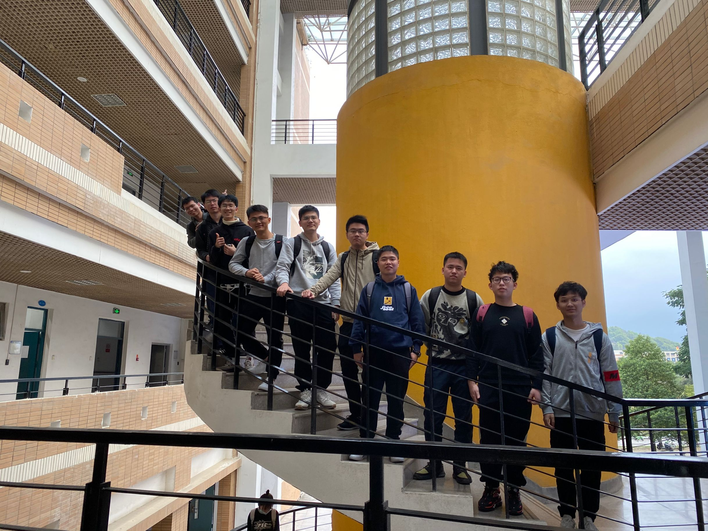

| 这个作业属于哪个课程 | [2021春软件工程实践W班 (福州大学)](https://edu.cnblogs.com/campus/fzu/2021SpringSoftwareEngineeringPractice) |
| -------------------- | ------------------------------------------------------------ |
| 这个作业要求在哪里   | [团队作业一](https://edu.cnblogs.com/campus/fzu/2021SpringSoftwareEngineeringPractice/homework/11848) |
| 团队名称             | 菜购                                                         |
| 这个作业的目标       | 决定学期选题 团队介绍                                        |

------

[toc]
### 队名
**菜购**

### 团队项目描述
采用“今日下单+次日送达+门店自提”的模式针对老年人和年轻人的新型社区买菜项目
### 队员风采

| 学号           | 041802224                                             | 昵称     | hanmajack |
| -------------- | ----------------------------------------------------- | -------- | :-------- |
| 博客园地址     | [博客地址](https://www.cnblogs.com/hanma/ "博客地址") | 性格     | 积极      |
| 擅长的技术     | 安卓                                                  | 兴趣爱好 | 足球      |
| 希望的软工角色 | 前端                                                  | slogan   | 划水      |

| 学号           | 051805124                                                  | 姓名     | 王少聪       |
| -------------- | ---------------------------------------------------------- | -------- | ------------ |
| 博客园地址     | [博客地址](https://www.cnblogs.com/kirito0206/ "博客地址") | 性格     | 积极、稳重   |
| 擅长的技术     | 前端                                                       | 兴趣爱好 | 学习         |
| 希望的软工角色 | 前端                                                       | slogan   | 冲就完事了！ |

| 学号           | 221801404                                                  | 姓名     | Aurora       |
| -------------- | ---------------------------------------------------------- | -------- | ------------ |
| 博客园地址     | [博客地址](https://www.cnblogs.com/weihaochen/ "博客地址") | 性格     | 稳重         |
| 擅长的技术     | java                                                       | 兴趣爱好 | 运动         |
| 希望的软工角色 | 后端                                                       | slogan   | 不会可以学！ |

| 学号           | 221801421                                             | 昵称     | unoni                 |
| -------------- | ----------------------------------------------------- | -------- | --------------------- |
| 博客园地址     | [博客地址](https://www.cnblogs.com/unoni/ "博客地址") | 性格     | 稳重                  |
| 擅长的技术     | 安卓                                                  | 兴趣爱好 | ADV                   |
| 希望的软工角色 | 安卓前端                                              | slogan   | 全世界无产者联合起来! |

| 学号           | 221801408                                                    | 昵称     | 冷夜梦                     |
| -------------- | ------------------------------------------------------------ | -------- | -------------------------- |
| 博客园地址     | [博客地址](https://home.cnblogs.com/u/liaolongkai/ "博客地址") | 性格     | 积极                       |
| 擅长的技术     | java                                                         | 兴趣爱好 | 假面骑士，电竞             |
| 希望的软工角色 | UI界面设计                                                   | slogan   | 重铸软工荣耀，吾辈义不容辞 |

| 学号           | 111801206                                       | 姓名     | 傅灿宇         |
| -------------- | ----------------------------------------------- | -------- | -------------- |
| 博客园地址     | [博客园地址](https://www.cnblogs.com/seraph-1/) | 性格     | 鸽             |
| 擅长的技术     | 安卓                                            | 兴趣爱好 | 种田游戏       |
| 希望的软工角色 | 前端                                            | slogan   | we are in nior |

| 学号           | 221801413                                    | 昵称     | Phara       |
| -------------- | -------------------------------------------- | -------- | ----------- |
| 博客园地址     | [博客园地址](https://www.cnblogs.com/phara/) | 性格     | 沉稳，内敛  |
| 擅长的技术     | JAVA                                         | 兴趣爱好 | 跑步，电影  |
| 希望的软工角色 | JAVA后端                                     | slogan   | bug远离我！ |

| 学号           | 221801224                                       | 昵称     | Aye_zang          |
| -------------- | ----------------------------------------------- | -------- | ----------------- |
| 博客园地址     | [博客园地址](https://www.cnblogs.com/aye-zang/) | 性格     | 生有热烈 藏于俗常 |
| 擅长的技术     | UE4引擎                                         | 兴趣爱好 | 吉他 钢琴         |
| 希望的软工角色 | UI设计、后端逻辑编码                            | slogan   | 40岁前发量充足    |

| 学号           | 081800306                                  | 昵称     | 陈志君           |
| -------------- | ------------------------------------------ | -------- | ---------------- |
| 博客园地址     | [博客地址](https://www.cnblogs.com/Dusks/) | 性格     | 积极             |
| 擅长的技术     | 前端                                       | 兴趣爱好 | 学习             |
| 希望的软工角色 | 前端                                       | slogan   | coding the world |

| 学号           | 2218014022                                                   | 昵称     | Kosmos1                    |
| -------------- | ------------------------------------------------------------ | -------- | -------------------------- |
| 博客园地址     | [博客地址](https://www.cnblogs.com/Kosmos1/ "博客地址") | 性格     | 积极                       |
| 擅长的技术     | 安卓                                                         | 兴趣爱好 | 看书                       |
| 希望的软工角色 | UI界面设计                                                   | slogan   | 重铸菜购荣耀，吾辈义不容辞 |

### 团队的首次合照

### 团队绩效考核方案

我们经过讨论后将团队的总贡献分定为100分，每人十分。十分按照计划实现、工作量、工作影响度、团队交流、互助分五个部分划分，每部分两份。

每个成员完成阶段的任务计划就能拿到计划实现的两分，若无法达到要求就拿到一份。工作量是团队项目从无到有的必需的保证，当然工作不能是能靠量来度量，工作影响度是取决于工作在项目进展中对整个团队的影响。团队交流需要成员们经常交流探讨来获取分数，互助分则是每个成员在完成自己任务的过程中或之后对别的成员的帮助给出的。

每个成员的绩效10分分配完之后相加得出团队总分，希望这样的绩效能够有助于团队的成长。

### 团队的愿景
+ 我们选题的初衷主旨是采用“今日下单+次日送达+门店自提”的模式，围绕社区居民日常生活所需，满足不同用户的差异化需求。打算将实现到整体业务流程能跑通的程度。该项目可以小区为单位落地实行，解决了上班族或者没空去买菜的人的烦恼，给人们带来生活上的便利。

+ “今天吃什么”已经成为困扰年轻人的日常难题，我们的项目就是为了解决上班族的不知道吃什么、没有时间亲自挑选食材以及荤素营养搭配不当等问题。节约用户时间的同时，也提供了一个良好的膳食搭配。
